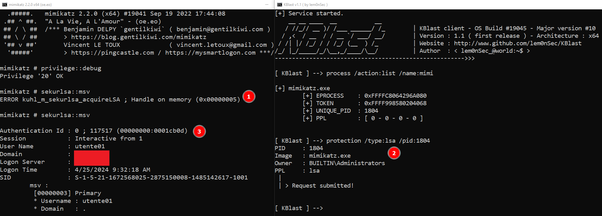

# KBlast

  

<p align="center">
  
</p>

__Windows Kernel Offensive Toolset__

-----------------------------------------------------------------------------------------------------------------------------------------------------------------
`KBlast` is a small application I built while experimenting with Windows kernel offensive security techniques. It puts together almost all the techniques discussed in the [Offensive Driver Development](https://training.zeropointsecurity.co.uk/courses/offensive-driver-development) course from Zero Point Security, plus some extra techniques. I thought that building up this tool rather than writing down a cheatsheet was a better way to both put into practice the concepts learned and provide the community with a comprehensive learning resource.

```
    __ __ ____  __           __
   / //_// __ )/ /___ ______/ /_        | KBlast client - OS Build #19045 - Major version #10
  / ,<  / __  / / __ `/ ___/ __/        | Version : 1.1 ( first release ) - Architecture : x64
 / /| |/ /_/ / / /_/ (__  ) /_          | Website : http://www.github.com/lem0nSec/KBlast
/_/ |_/_____/_/\__,_/____/\__/          | Author  : < lem0nSec_@world:~$ >
------------------------------------------------------->>>

[ KBlast ] --> help

Commands - ' generic ' ( generic commands. Do not initiate kernel interactions )
              help:     Show this help
              quit:     Quit KBlast
               cls:     Clear the screen
            banner:     Print KBlast banner
               pid:     Show current pid
              time:     Display system time
           version:     Display system version information
            !{cmd}:     Execute system command

Examples:
No example is available for ' generic ' commands


[ KBlast ] -->
```
## How it works
This tool has two components. KBlaster.sys is the application's driver, the actual core where all central features reside. In contrast, KBlast.exe is the client application. KBlast.exe takes user commands, generate a specific input to be sent to KBlaster, and once the driver has finished its operation the client may or may not return the result of the operation depending on what was done.

## Commands and Features
KBlast commands can fall into four categories which must be prepended to the actual command (generic commands can be just typed and run right away). Categories can be:

- process (process kernel-side interactions)
- protection (protection PPL)
- token (token management)
- callback (kernel callbacks)
- blob (memory read/write)
- misc (misc functionalities)


## Examples
The following screenshot shows the swapping of a high-integrity powershell token with a system-level token (System process pid 4).


The following screenshot shows the elevation of mimikatz PPL to LSA. Mimikatz is now granted read access to lsass.




## Installation Notes
Since KBlaster.sys is just a driver I built for my own learning, it does not come with signing. Enabling `testsigning` mode with the following command is required to play with this tool.

- `bcdedit /set testsigning on`


## Important note :warning:
__This tool is still at an early stage of development.__ KBlast is being actively tested on a Windows 10 Pro build 19045 x64 machine. Some functionalities support other Windows versions. Others don't. The following are the main issues you may encounter:

- Module    : Callback : compatible only with Windows 10 Pro build 19045 x64
- Command   : Token - revert : it works only if the process whose token is to be reverted is the last one whose token was modified
- Command   : Misc - dse : still under testing on Windows 10 Pro build 19045 x64 (you should not rely on this command at this stage of develpment).


To clarify, the following is the output of 'version' command on the system I am using to build the tool.

```
[ KBlast ] --> version
Microsoft Windows NT 10.0 OS Build 19045 ( Arch x64 )
KBlast v1.1 ( Arch x64 )
```

Since the Windows Kernel is mostly composed of 'opaque' data structures, this tool is likely to trigger bsods at this stage of development if a version other than the one mentioned is used. Development of these tools often requires months. I hope you understand and appreciate the project and the idea behind!
Last but not least, I might consider adding new features such as process unlinking if the project will turn out a useful resource for learners.
