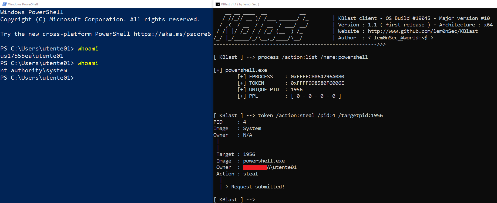
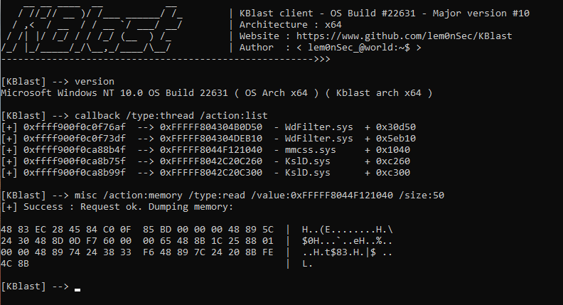

# KBlast

  

<p align="center">
  
</p>

__Windows Kernel Offensive Toolset__

-----------------------------------------------------------------------------------------------------------------------------------------------------------------
`KBlast` is a small application I built while experimenting with Windows kernel offensive security techniques. I started this project years ago and I add features from time to time. I consider this tool like a 'box' containing Windows kernel-related offensive security techniques.

```
    __ __ ____  __           __
   / //_// __ )/ /___ ______/ /_        | KBlast client - OS Build #22631 - Major version #10
  / ,<  / __  / / __ `/ ___/ __/        | Architecture : x64
 / /| |/ /_/ / / /_/ (__  ) /_          | Website : https://www.github.com/lem0nSec/KBlast
/_/ |_/_____/_/\__,_/____/\__/          | Author  : < lem0nSec_@world:~$ >
------------------------------------------------------->>>

[KBlast] --> help
                          help  -       Show this help
                          quit  -       Quit KBlast
                         clear  -       Clear the screen
                           pid  -       Show current pid
                          time  -       Display system time
                       version  -       Display system version information
                             !  -       Execute system command

[KBlast] --> !whoami
```
## How it works
This tool has two components. `KBlaster.sys` is the application's driver where all central features reside. `KBlast.exe` is the client application taking commands and sending them to the driver.

## Commands and Features
KBlast commands can fall into five 'modules' which must be prepended to the actual command (standard commands can be just typed and run right away). Modules can be:

- process
- protection (PPL)
- token (token management)
- callback (kernel callbacks - Process, Thread, Image, Registry, Object for now)
- misc (misc functionalities such as R/W)


## Examples
Swapping current token (high integrity) with System's (system integrity).




Thread notify routines enumeration and memory dump.




## Installation Notes
Since KBlaster.sys is just a driver I built for my own learning, it does not come with signing. Enabling `testsigning` mode with the following command is required to play with this tool.

- `bcdedit /set testsigning on`

