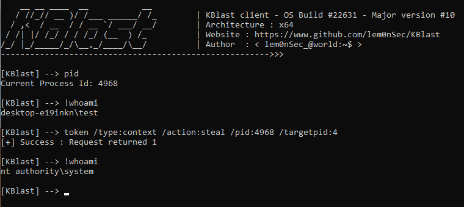

# KBlast

  

<p align="center">
  
</p>

__Windows Kernel Offensive Toolset__

-----------------------------------------------------------------------------------------------------------------------------------------------------------------
`KBlast` is a small application I built while experimenting with Windows kernel offensive security techniques. I started this project years ago and I add features from time to time. I consider this tool like a 'box' which containes Windows kernel-related security techniques that I decide to translate into code.

```
    __ __ ____  __           __
   / //_// __ )/ /___ ______/ /_        | KBlast client - OS Build #22631 - Major version #10
  / ,<  / __  / / __ `/ ___/ __/        | Architecture : x64
 / /| |/ /_/ / / /_/ (__  ) /_          | Website : https://www.github.com/lem0nSec/KBlast
/_/ |_/_____/_/\__,_/____/\__/          | Author  : < lem0nSec_@world:~$ >
------------------------------------------------------->>>

[KBlast] --> help
                          help  -       Show this help
                          quit  -       Quit KBlast
                         clear  -       Clear the screen
                           pid  -       Show current pid
                          time  -       Display system time
                       version  -       Display system version information
                             !  -       Execute system command

[KBlast] --> !whoami
```
## How it works
This tool has two components. `KBlaster.sys` is the application's driver where all central features reside. `KBlast.exe` is the client application, which takes commands and reaches out to Kblaster.

## Commands and Features
KBlast commands can fall into five 'modules' which must be prepended to the actual command (standard commands can be just typed and run right away). Modules can be:

- process
- protection (PPL)
- token (token management)
- callback (kernel callbacks - Process, Thread, Image, Registry for now)
- misc (misc functionalities such as R/W)


## Examples
The following screenshot shows the swapping of a high-integrity powershell token with a system-level token (System process pid 4).




The following screenshot shows the elevation of mimikatz PPL to LSA. Mimikatz is now granted read access to lsass.


## Installation Notes
Since KBlaster.sys is just a driver I built for my own learning, it does not come with signing. Enabling `testsigning` mode with the following command is required to play with this tool.

- `bcdedit /set testsigning on`

Under specific conditions, KBlast may be able to zero out g_cioptions using [KExecDD](https://github.com/floesen/KExecDD) and load KBlaster even though testsigning is disabled. Bear in mind that an unsuccessful attempt likely means BSOD.


## Important note :warning:
__This tool is still at an early stage of development.__ KBlast is being actively tested on a Windows 10 Pro build 19045 x64 machine. Some functionalities support other Windows versions. Others don't. The following are the main issues you may encounter:

- Module    : Callback : compatible only with Windows 10 Pro build 19045 x64
- Command   : Token - revert : it works only if the process whose token is to be reverted is the last one whose token was modified
- Command   : Misc - dse : I recently receplaced hardcoded offsets with more stable parser functions. There may still be problems under certain conditions.


To clarify, the following is the output of 'version' command on the system I am using to build the tool.

```
[ KBlast ] --> version
Microsoft Windows NT 10.0 OS Build 19045 ( Arch x64 )
KBlast v1.1 ( Arch x64 )
```

Since the Windows Kernel is mostly composed of 'opaque' data structures, this tool is likely to trigger bsods at this stage of development if a version other than the one mentioned is used. Development of these tools often requires months. I hope you understand and appreciate the project and the idea behind!
Last but not least, I might consider adding new features such as process unlinking if the project will turn out a useful resource for learners.
